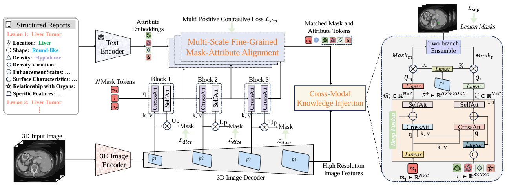

# Unleashing the Potential of Vision-Language Pre-Training for 3D Zero-Shot Lesion Segmentation via Mask-Attribute Alignment
[Yankai Jiang](https://scholar.google.com/citations?user=oQKcL_oAAAAJ)1, [Wenhui Lei](https://scholar.google.com/citations?hl=zh-CN&user=kvD7060AAAAJ)2, [Xiaofan Zhang](https://scholar.google.com/citations?user=30e95fEAAAAJ)2, [Shaoting Zhang](https://scholar.google.com/citations?user=oiBMWK4AAAAJ)2

1Shanghai AI Lab, &nbsp;
2Shanghai Jiao tong University

**ICLR 2025**

[📄 **Paper**](https://arxiv.org/abs/2410.15744)&nbsp; | &nbsp;[🌐 **Project Page**](https://github.com/Yankai96/Malenia)

## 🚀 Overview

## 📖 Description
Recent advancements in medical vision-language pre-training models have driven significant progress in zero-shot disease recognition. However, transferring image-level knowledge to pixel-level tasks, such as lesion segmentation in 3D CT scans, remains a critical challenge. Due to the complexity and variability of pathological visual characteristics, existing methods struggle to align fine-grained lesion features not encountered during training with disease-related textual representations. 

We present Malenia, a novel **multi-scale lesion-level mask-attribute alignment framework**, specifically designed for 3D zero-shot lesion segmentation. Malenia improves the compatibility between mask representations and their associated elemental attributes, explicitly linking the visual features of unseen lesions with the extensible knowledge learned from previously seen ones. Furthermore, we design a Cross-Modal Knowledge Injection module to enhance both visual and textual features with mutually beneficial information, effectively guiding the generation of segmentation results. Comprehensive experiments across three datasets and 12 lesion categories validate the superior performance of Malenia.

## 🎉 News
- **\[2025/01\]** Malenia is accepted to ICLR 2025!

## 🚩 Plan
- ✅ Release the disease attribute description annotations on publicly available datasets.
- ⭕ Release the pre-trained model weights.
- ⭕ Release the inference code.

## 📊 Annotations for Disease Attribute Description

We have released part of our disease-attribute description annotations for multiple CT datasets, covering the following lesions: (1) renal cell carcinoma, (2) renal cyst, (3) hepatocellular carcinoma, (4) pancreatic cancer, (5) pancreatic cyst, (6) colorectal cancer, and (7) lung cancer. For each CT image case, the annotations include: (1) the original file name from the dataset; (2) structured descriptions of eight shared visual attributes characterizing disease imaging features—namely, location, shape, density, density variations, surface characteristics, enhancement status, relationships with surrounding organs, and specific features; and (3) the complete unstructured radiology report.

In particular, we release bilingual versions of the annotations, including one set in English and another set in Chinese. Details are provided in the two accompanying .xlsx files.
